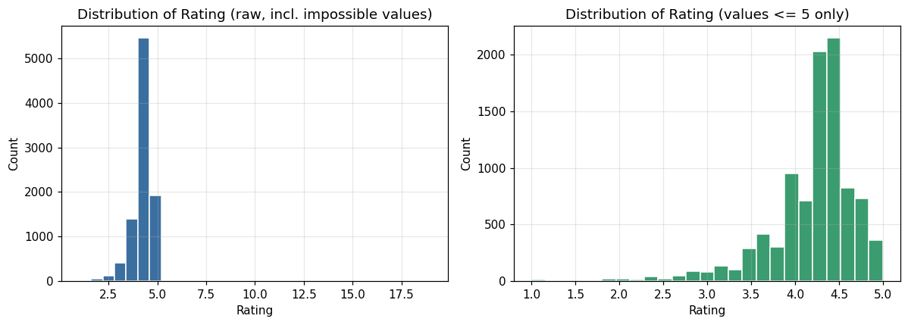
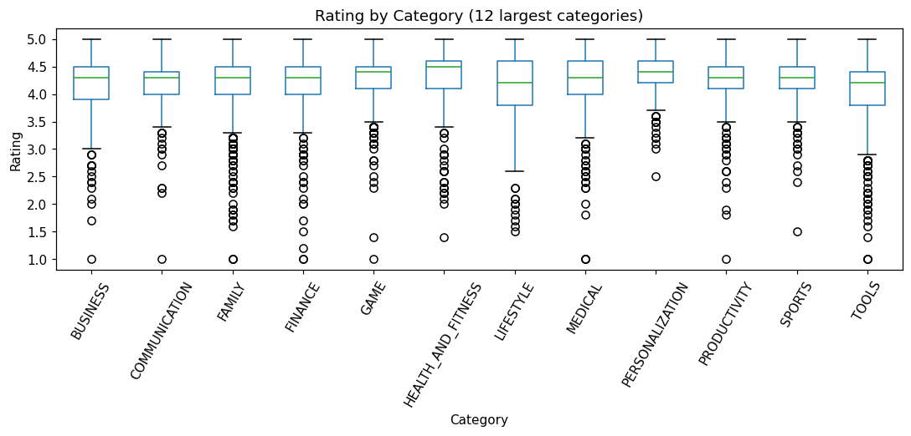
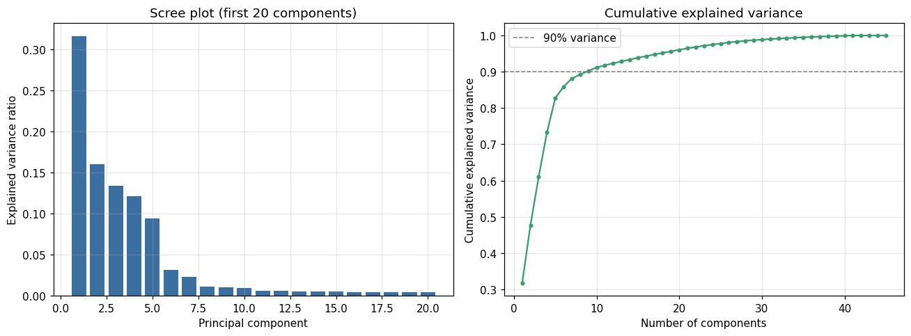
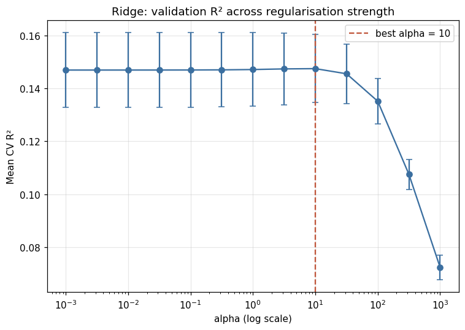
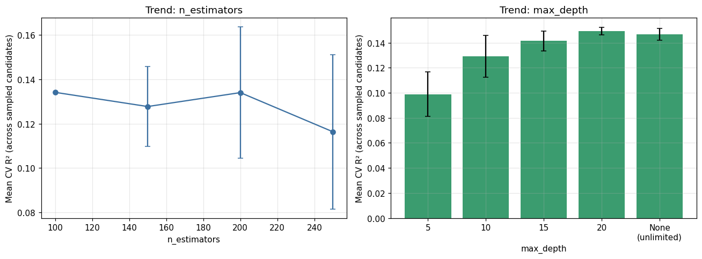
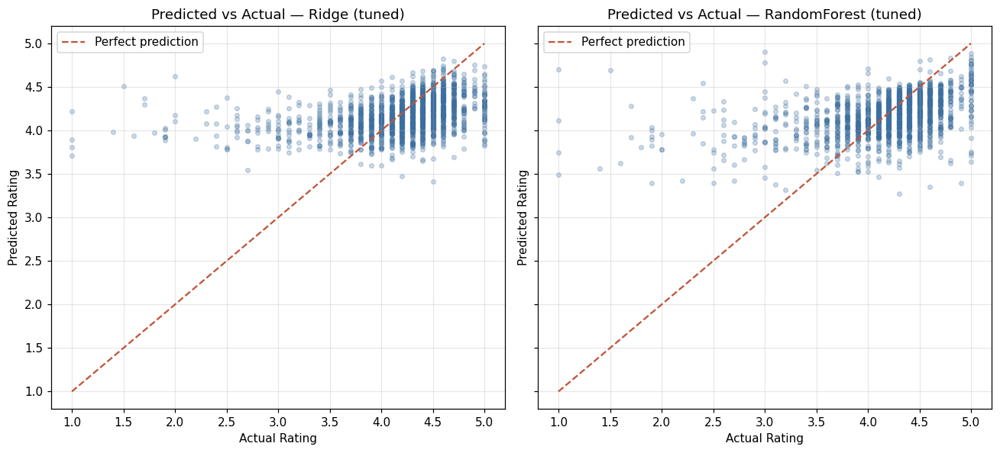
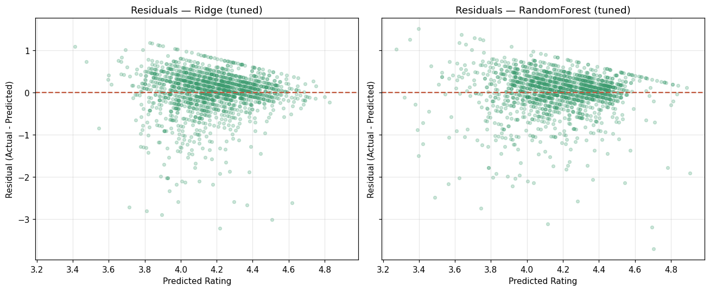
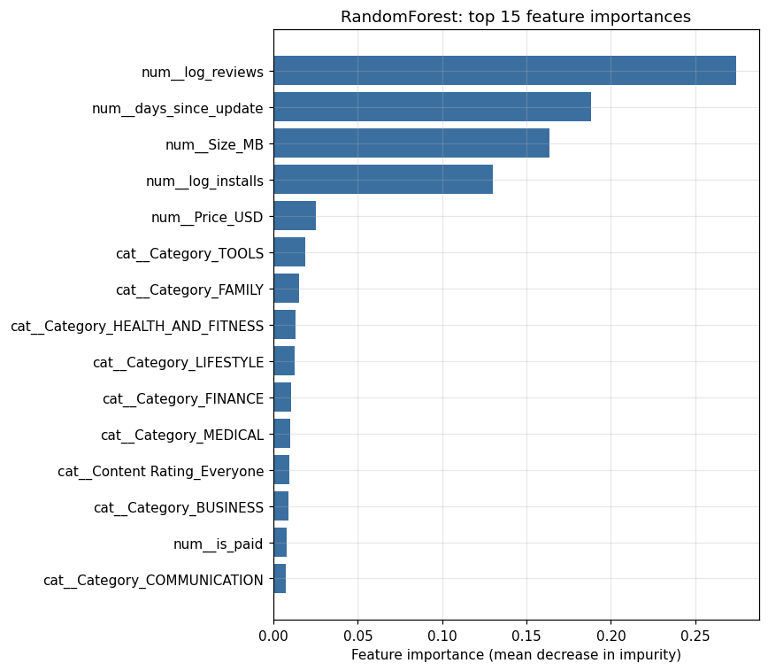

# CSE437 Data Science — Project Report

## Cover

- **Project title:** Predicting Google Play Store App Ratings Using Machine Learning
- **Course:** CSE437 Data Science
- **Section:** >>> 05<<<
- **Semester:** >>> Summer 2026 <<<
- **Group:** 15
- **Group members:**
  - Khondokar Waysal E Mustafa — ID 23341001
- **GitHub repository:** >>>https://github.com/waysal1/cse437-google-play-app-rating-15 <<<
- **Date:** September 3, 2026

## Summary

This project predicts a Google Play Store app's user `Rating` (1–5 stars, continuous) from its listing metadata — category, review and install counts, size, price, type, and update recency — using the Kaggle *Google Play Store Apps* dataset (10,841 raw rows, cleaned to 8,196). We compared two regression families, Ridge Regression and Random Forest, after leakage-safe preprocessing, feature engineering, and hyperparameter tuning via cross-validation. Primary metric: test R². Random Forest performed best (R² = 0.164, MAE = 0.338, RMSE = 0.499), narrowly ahead of Ridge (R² = 0.140); both clearly beat a mean-prediction baseline (R² ≈ 0). The most important finding is that review volume and update recency carry the strongest, though still modest, signal, while error analysis shows the models fail specifically on low-review apps and at extreme ratings. This confirms the faculty's expectation that app metadata alone explains only a small share of rating variance, since it cannot capture app quality, user experience, or developer responsiveness — the deeper drivers of a subjective rating.

## 1. Problem and Dataset

### 1.1 Problem statement

Mobile application ratings are an important indicator of user satisfaction and app quality. However, ratings may be influenced by several characteristics such as app category, number of reviews, number of installs, size, price, and app type. The objective of this project is to analyze the factors associated with Google Play Store app ratings and develop machine-learning regression models to predict an application's rating based on its available characteristics.

### 1.2 Dataset

**Source:** Google Play Store Apps dataset (Kaggle) — https://www.kaggle.com/datasets/lava18/google-play-store-apps
**License:** Creative Commons Attribution 3.0 Unported (CC BY 3.0), per the `license.txt` file distributed with the dataset download and reproduced at the repository root.
**Collection method:** Apps and metadata scraped from the Google Play Store listing pages.
**Size:** 10,841 rows × 13 columns as downloaded (`googleplaystore.csv`); after cleaning, 8,196 rows × 17 columns.
**Time period:** No explicit collection date is provided; the `Last Updated` field ranges up to August 8, 2018, indicating the scrape was performed shortly after that date.

### 1.3 Target variable

**Name:** `Rating`. **Type:** continuous, nominally bounded 1.0–5.0. After cleaning, mean = 4.17, median = 4.3, std = 0.54 (n = 8,196). The distribution is strongly left-skewed: most apps sit between 4.0 and 4.5, with a long, sparse tail toward 1.0 (Figure 1).

{width=85%}

### 1.4 Three questions

1. Which app characteristics, such as category, reviews, installs, size, price, and app type, are most strongly associated with Google Play Store ratings?
2. How accurately can machine-learning regression models predict an application's rating using its available characteristics?
3. Which machine-learning model and feature set provides the best rating prediction performance after preprocessing, feature selection, dimensionality reduction, and hyperparameter tuning?

## 2. Data Handling and Preprocessing

### 2.1 Data quality audit

- **Missing values:** `Rating` 1,474 (13.6%), `Type` 1, `Content Rating` 1, `Current Ver` 8, `Android Ver` 3.
- **Duplicates:** 9,660 unique `App` names out of 10,841 rows → 1,181 duplicate rows (some apps appear up to 9 times, e.g. `ROBLOX`).
- **Malformed row:** Row index 10472 (`App = "Life Made WI-Fi Touchscreen Photo Frame"`) had every field from `Category` onward shifted one column left, producing an impossible `Rating = 19.0`. Reconstruction showed the true `Category` was blank at source, which caused the shift; all other fields were recoverable.
- **Inconsistent categories:** `Category` contained one non-category value, `'1.9'` — the fingerprint of the malformed row above.
- **Impossible values:** one `Rating > 5` (the malformed row); a stray `Type = '0'` and `Installs = '0'/'0+'` values traced to the same row and to one newly-listed app with zero installs.

### 2.2 Missing values

| Column | Strategy | Justification |
|---|---|---|
| `Rating` (target) | Drop row | A missing label cannot be used for supervised training; imputing a subjective rating would fabricate the exact quantity being predicted. |
| `Category` (malformed row only) | Drop row (1 row) | True value unrecoverable at source; negligible loss (0.009% of data). |
| `Type`, `Content Rating` | Verified — resolved automatically | Both single missing values coincided with rows already removed for missing `Rating` or the malformed row. |
| `Current Ver`, `Android Ver` | Retain as missing | Not named in the approved research questions; excluded from the model feature set rather than imputed. |
| `Size` ("Varies with device" → `Size_MB` missing, 1,170 rows) | Left missing; imputed only inside the training-only modelling pipeline (median) | Filling with a learned statistic before the train/test split would leak information; deferred per the leakage-prevention rule. |

### 2.3 Outliers

**Method:** IQR rule (`[Q1 − 1.5×IQR, Q3 + 1.5×IQR]`) applied to each numeric column on the cleaned dataset.

| Column | % flagged | Decision |
|---|---|---|
| `Reviews` | ~17% | Retain; `log1p`-transform (real right-skew, not error) |
| `Installs` | ~24% | Retain; `log1p`-transform |
| `Price` | ~7% | Retain, no transform (reflects the Free/Paid structural split) |
| `Size_MB` | ~5.5% | Retain, no transform (plausible large-app sizes) |
| `Rating` | ~6% | Retain (genuine low-rated apps; essential target signal) |

No rows were removed for being statistically extreme; only genuinely invalid data (the malformed row, missing target) was removed.

### 2.4 Transformation and scaling

Raw text fields were parsed deterministically: `Size` → MB (M/k suffixes converted; "Varies with device" → missing), `Installs` → integer (comma/`+` stripped), `Price` → float (`$` stripped), `Reviews` → integer, `Last Updated` → datetime. `Category` and `Content Rating` were one-hot encoded (`handle_unknown='ignore'`, since two rare `Content Rating` levels occur only in the training split). Numeric features were standardized (`StandardScaler`) for Ridge only — Random Forest does not require scaling. **All imputation, scaling, and encoding was fit on the training split only**, inside `sklearn` `Pipeline`/`ColumnTransformer` objects, and applied unchanged to the test split.

### 2.5 Before and after

| Stage | Rows | Cols | Unique apps | Duplicate rows | Missing `Rating` |
|---|---|---|---|---|---|
| Raw loaded | 10,841 | 13 | 9,660 | 1,181 | 1,474 |
| Malformed row handled | 10,840 | 13 | 9,659 | 1,181 | 1,474 |
| Deduplicated (kept max-`Reviews` row) | 9,659 | 13 | 9,659 | 0 | 1,463 |
| Target validated (dropped missing `Rating`) | 8,196 | 13 | 8,196 | 0 | 0 |
| Parsed (Size_MB, Installs, Price, dates added) | 8,196 | 17 | 8,196 | 0 | 0 |

## 3. Statistical Analysis

### 3.1 Descriptive statistics

`Rating` (n=8,196): mean 4.17, median 4.3, std 0.54. `Reviews`: heavily right-skewed, median 3,017 vs. mean 255,501. `Installs`: median 100,000 vs. mean 9.2 million — a handful of viral apps pull the mean far above the median. Paid apps (n=602, 7.3% of the data) average $14.10. `Size_MB` averages 21.8 MB (median 13.0 MB) among the 7,026 apps with a known size. `Category` is dominated by `FAMILY` (1,651 apps) and `GAME` (898); `Content Rating` is dominated by `Everyone` (6,618, 81%); `Type` is 92.7% `Free`.

### 3.2 Relationships

Simple linear correlations with `Rating`: `log_reviews` 0.183 (strongest), `days_since_update` −0.130 (more recently updated apps rate higher), `log_installs` 0.085, `Size_MB` 0.063, `Price_USD` −0.021 (weakest). Category-level differences are real but mild — median `Rating` varies only from about 4.2 to 4.5 across the largest categories (Figure 2).

{width=80%}

### 3.3 What the data says so far

1. The target is left-skewed and concentrated between 4.0–4.5, limiting how much variance any model can explain.
2. Even the best single predictor (`log_reviews`) correlates only weakly (r ≈ 0.18) with `Rating`.
3. Category differences exist but are modest, not dominant.
4. `Genres` (114 levels) is largely a finer split of `Category` (33 levels) and adds cardinality without independent signal.
5. Several raw columns (`Reviews`, `Size`, `Installs`, `Price`) require explicit parsing before use.

## 4. Feature Engineering

### 4.1 Derived features

- `log_reviews`, `log_installs` — `log1p` of the two heavily right-skewed count columns.
- `is_paid` — binary flag from `Price_USD > 0`.
- `days_since_update` — chosen over a coarser `last_updated_year` after confirming both carry the same mirror-image signal; the finer-grained version was kept.
- `Size_MB` — reused from preprocessing.

### 4.2 Dimensionality reduction

PCA was fit on the training split only. Five components explain ~80% of variance, 9 components ~90%, 18 ~95% (Figure 3). **PCA was tested empirically via cross-validation and rejected**: it reduced Ridge's CV R² from 0.147 to 0.048, and Random Forest's from 0.130 to 0.096 (both fit on the same 100%-training-only comparison). PCA is **not** part of the final pipeline.

{width=85%}

### 4.3 Feature selection

**Method:** `f_regression` via `SelectKBest`, fit on training data only. **Threshold:** `p < 0.05`. Of 45 one-hot-encoded feature dimensions, 22 were statistically significant; top scorers were `log_reviews` (F=225.9), `days_since_update` (F=95.2), `Category_TOOLS` (F=50.5), and `log_installs` (F=46.6). This subset was also tested empirically (CV R² = 0.144 for Ridge, vs. 0.147 for the full space) and showed **no measurable benefit**, so it was not adopted for final modelling either.

### 4.4 Final feature set

**Kept (8 raw columns → 45 dimensions after one-hot encoding):** `log_reviews`, `log_installs`, `Size_MB`, `Price_USD`, `is_paid`, `days_since_update` (numeric); `Category`, `Content Rating` (categorical).

**Dropped:** `App` (unique identifier); `Type` (redundant with `is_paid`); `Genres` (redundant with `Category`, 114 vs. 33 levels); `Current Ver`/`Android Ver` (near-unique version strings, not in the approved questions); raw `Reviews`/`Installs`/`Price`/`Size` strings and `Last Updated`/`last_updated_year` (superseded by parsed/derived versions).

## 5. Modeling and Validation

### 5.1 Validation strategy

An 80/20 train/test split (`random_state=42`) was performed **before** any learned transformation. Model development and tuning used 5-fold `KFold(shuffle=True, random_state=42)` cross-validation on the training split only. No temporal or grouping structure applies (each row is an independent app), so no special split logic beyond a fixed seed was needed.

### 5.2 Baseline

`DummyRegressor(strategy='mean')`: CV R² = −0.0004 (± 0.0005), test R² ≈ 0.000, MAE = 0.383, RMSE = 0.546 — the error scale any real model must beat.

### 5.3 Model families

**Ridge Regression** — suited to this problem because the one-hot-encoded feature space (45 dimensions, several correlated: e.g. `log_reviews`/`log_installs`) is moderately collinear; L2 regularization stabilizes coefficient estimates and yields interpretable, directly comparable coefficients. Assumes an approximately linear relationship between features and `Rating`, which caps achievable R² if the true relationship is non-linear.

**Random Forest Regressor** — suited because it makes no linearity assumption and can capture non-linear/interaction effects (e.g. category-specific review effects) without manual specification, and handles the mixed numeric/categorical space without scaling. Its main risk with a weak true signal is overfitting individual noisy splits; this is why `max_depth`, `min_samples_split`, and `min_samples_leaf` were tuned.

### 5.4 Metrics

**Primary metric: R²**, declared before any test result was seen, because it is scale-free, comparable across model families, and the metric the faculty's expected range (0.05–0.15) is stated in. **Secondary metrics: MAE, RMSE**, reported in rating-point units for practical interpretability.

## 6. Hyperparameter Tuning

### 6.1 Search space

| Model | Hyperparameter | Values searched |
|---|---|---|
| Ridge | `alpha` | 13 log-spaced values, 0.001 to 1000 |
| Random Forest | `n_estimators` | 100, 150, 200, 250 |
| Random Forest | `max_depth` | 5, 10, 15, 20, None |
| Random Forest | `min_samples_split` | 2, 5, 10 |
| Random Forest | `min_samples_leaf` | 1, 2, 4 |
| Random Forest | `max_features` | sqrt, log2, 0.5 |

### 6.2 Method

**Ridge:** exhaustive `GridSearchCV`, 13 candidates × 5 folds = 65 fits, scoring = `r2`. **Random Forest:** the full grid (540 combinations) was not computationally reasonable on the single-CPU environment used, so `RandomizedSearchCV` was used instead: 20 candidates × 5 folds = 100 fits, scoring = `r2`.

### 6.3 Results

**Ridge:** best `alpha = 10`, CV R² = 0.1475. CV R² is essentially flat across a wide middle range of alpha and only degrades at extremes (Figure 4) — the ceiling is set by weak signal, not regularization strength.

{width=70%}

**Random Forest:** best configuration `n_estimators=200, max_depth=None, min_samples_split=10, min_samples_leaf=2, max_features=0.5`, CV R² = 0.1533 (up from 0.1138 with default hyperparameters — a real tuning gain, unlike Ridge). Very shallow trees (`max_depth=5`) clearly underperformed; depth stopped mattering much beyond 10–20 (Figure 5).

{width=95%}

## 7. Results, Visualization and Error Analysis

### 7.1 Test set performance

Evaluated once, after all model development:

| Model | R² | MAE | RMSE |
|---|---|---|---|
| Dummy baseline | ~0.000 | 0.383 | 0.546 |
| Ridge (tuned) | 0.140 | 0.345 | 0.506 |
| Random Forest (tuned) | **0.164** | **0.338** | **0.499** |

### 7.2 Visualization

{width=78%}

{width=78%}

{width=60%}

Both models' predictions cluster in a narrow band (~3.8–4.5) regardless of the true rating (Figure 6), and residuals show a long tail of large negative values — true low-rating apps the models failed to identify (Figure 7). RandomForest importance (Figure 8) is dominated by `log_reviews` (0.274), `days_since_update` (0.188), `Size_MB` (0.164), and `log_installs` (0.130); `Category` dummies contribute smaller individual amounts. Ridge's largest-magnitude coefficients are `log_reviews` (+0.58) and `log_installs` (−0.51); this opposite-sign pair is a collinearity artifact (the two are highly correlated), not evidence that installs hurt ratings — RandomForest importance, unaffected by this sign-splitting, shows both contributing positively. The error-distribution histogram and full Ridge coefficient chart are saved in `figures/13_error_distribution.png` and `figures/15_ridge_coefficients.png`.

### 7.3 Error analysis

| Subgroup | MAE (Random Forest) |
|---|---|
| Reviews < 100 | 0.548 |
| Reviews ≥ 100 | 0.271 |
| Installs ≥ 1,000,000 | 0.183 |
| Installs < 1,000,000 | 0.385 |
| Free apps | 0.337 |
| Paid apps | 0.357 |
| Rating 1.0–2.0 | **2.371** |
| Rating 4.0–4.5 | **0.169** |

Errors are roughly **double** for low-review apps and **highest by far** at extreme low ratings — a clear regression-to-the-mean pattern: with little usage history to go on, the model defaults toward the population mean (~4.17), so genuinely low-rated apps are predicted far too high. `DATING` (MAE 0.646) and `LIFESTYLE` (0.511) are the worst-predicted categories; `EDUCATION` (0.182) and `SHOPPING` (0.217) the best.

**Example 1 — "House party - live chat" (`DATING`):** actual rating 1.0, predicted 4.70 (error −3.70); only 1 review and 10 installs — almost no usage signal, so the model falls back near the mean, while the true low rating likely reflects a specific bad experience the metadata cannot capture.

**Example 2 — "FK Atlantas" (`SPORTS`):** actual rating 1.5, predicted 4.70 (error −3.20); only 2 reviews and 5 installs — the same mechanism: too little signal to distinguish this app from any other unrated `SPORTS` app.

### 7.4 Answers to the three questions

**Q1 — Which characteristics matter most?** Review volume (`log_reviews`) and update recency (`days_since_update`) are the two strongest associations by a clear margin across every method used (correlation, `f_regression`, RandomForest importance, Ridge coefficients). `log_installs` and `Size_MB` are moderately important. `Category` matters diffusely (many small individual effects, no single dominant category). `Price`/`is_paid` show the weakest, though still statistically detectable, association.

**Q2 — How accurately can the models predict rating?** Modestly. Tuned models reach test R² = 0.140–0.164, MAE ≈ 0.34–0.35, RMSE ≈ 0.50–0.51 stars — a real improvement over the baseline (MAE 0.383), but the models are typically off by roughly a third of a star, and far less accurate for low-review apps and rating extremes (Section 7.3).

**Q3 — Which model/feature set performs best?** Tuned Random Forest on the **full 45-dimension feature space** (R² = 0.164), narrowly ahead of tuned Ridge (R² = 0.140). Both PCA and `f_regression` feature selection were tested and **reduced** performance, so neither is part of the best configuration. The margin between the two model families is narrow enough that both should be read as extracting a similarly modest amount of real signal.

## 8. Limitations and Next Steps

App metadata carries only a **weak** signal for a subjective quantity like `Rating`. Major likely drivers of a real user's rating are absent from this dataset: functional quality (bugs, crashes, load times), user-experience design, advertising load, developer responsiveness, evolving user expectations, and privacy concerns (plausibly relevant to the worst-predicted categories, `DATING` and `HEALTH_AND_FITNESS`). The dataset is also a single scrape, not a time series, so only associations — not causal or trend claims — are supported. With more time or data, useful extensions include: NLP features from the companion user-review text/sentiment file, developer-level reputation or update-history data, and category-specific models given how much error varies by category. The faculty's expected R² range (0.05–0.15) was met or nearly met without leakage or forced tuning; these results are an honest ceiling for metadata-only prediction, not a modelling shortfall.

## 9. Contributions

| Member | Student ID | Contribution |
|---|---|---|
| Khondokar Waysal E Mustafa | 23341001 | All stages: data audit, preprocessing, feature engineering, modelling, tuning, evaluation, error analysis, and report writing. |

## References

- Dataset: Lavanya, *Google Play Store Apps*, Kaggle. https://www.kaggle.com/datasets/lava18/google-play-store-apps (CC BY 3.0).
- Libraries: pandas, NumPy, scikit-learn, matplotlib.
- **AI assistance disclosure:** Claude (Anthropic) was used throughout this project to help write and execute the Jupyter notebooks (data auditing, preprocessing, feature engineering, modelling, tuning, and evaluation code), to design the analysis pipeline in line with the faculty's leakage-prevention and methodology requirements, and to draft this report from the notebooks' actual outputs. All code was executed and all reported numbers were verified against real notebook output before inclusion; no results in this report were fabricated or estimated.
